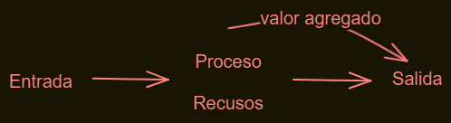

# Hoja de Operaciones y Hoja de Procesos

Asignatura: PROCESOS DE FABRICACIÓN INDUSTRIAL
Fecha de clase: 25/03/2025
Tipo de clase: EETP 612

## Hoja de Procesos

Es un documento en el que se describen ordenadamente todas las operaciones, materiales y herramientas que se necesitan para fabricar un objeto.

## Hoja de Operaciones

Es un documento en el que se explica de forma resumida como debe efectuarse cada una de las operaciones, indicando materiales, herramientas, tiempo necesario para llevarlas a cabo y persona responsable.

| Operaciones                                       | Descripción                                          | Materiales | Herramientas | Responsable | Tiempo |
| ------------------------------------------------- | ---------------------------------------------------- | ---------- | ------------ | ----------- | ------ |
| Fabricar la polea                                 | Cortar dos círculos de 8cm de diámetro y uno de 6cm. |
| Pegar los tres círculos y agujerear en el centro. | Contrachapado.                                       |
| Pegamento.                                        | Segueta.                                             |
Barrena.
Compás.
Regla.
Lápiz.
Taladro. | Juan.
María. | 30 min. |
| Fabricar los soportes | Cortar dos rectángulos de 10x5cm. | Contrachapado.
Varilla de madera. | Serrucho.
Regla.
Lápiz. | José.
Laura. | 20 min. |
| Montar la estructura | Pegar los soportes a la base y fijar la polea. | Pegamento. | Clavos.
Martillo. | Juan. | 30 min. |
| Montar el esquema eléctrico | Hacer la conexión eléctrica y de las demás partes. | Cable eléctrico.
Motor.
Pegamento. | Alicates.
Cinta aislante.
Destornillador. | José | 30 min. |

## Repetitividad de las operaciones en el proceso de producción

Un proceso de producción es cualquier actividad económica que genera un valor agregado. Estos procesos pueden someterse a diversos análisis para enfrentar los problemas que llegan a desarrollar, como la mejora de su eficiencia por medio de automatización, los métodos que sirvan para ampliar la productividad, lo mismo se busca de la optimización de la calidad o la sustentación económica.

# Procesos de producción

Asignatura: PROCESOS DE FABRICACIÓN INDUSTRIAL
Fecha de clase: 01/04/2025
Tipo de clase: EETP 612

Existen 4 tipos de procesos de producción:

## 1) Producción continua

Se trata de procesos continuos para grandes lotes en donde una red de depósitos forma una serie que la materia prima debe recorrer para transformarse en el producto final. Aquí no es tan imprescindible la intervención de personal en cada área, sino que se requiere de pocas personas que supervisen y realicen actividades discretas, es decir, el proceso es meramente automatizado.
En los sistemas controlados por la producción, se fabrica un gran volumen de un producto estándar de alta calidad al menor costo posible, el enfoque está en maximizar las eficiencias.
Cada operación es realizada sobre el mismo producto base, siguiendo una secuencia de manera que cada una de ellas le añade valor al producto, lo modifican y mejoran la anterior. Son procesos muy rutinarios, es un proceso poco modificable, pero si fue correctamente diseñado el proceso es de gran calidad y eficiencia.

La producción continua no es reciente y un ejemplo cercano a éste tipo de producción se realizó en el año 1914, la Ford Motor Company, empresa americana fabricante de automóviles, empleó las técnicas básicas de línea de producción para fabricar el automóvil T, creando la primera línea de producción móvil del mundo en ese año. El sistema de producción continuo es utilizado por las empresas que producen un determinado producto por un prolongado tiempo, no se presentan cambios en su ejecución.

Éste tipo de producción es aquel donde el contenido del trabajo del producto aumenta en forma continua. Es aquella donde el procesamiento del material es continuo y progresivo.

En resumen, procesos continuos significa que al concluir el trabajo determinado en cada operación, la unidad se pasa a la siguiente etapa de trabajo sin esperar todo el trabajo en el lote. La línea de producción  se debe considerar en conjunto como una entidad aislada y no permitiéndose averías en ningún lugar.

### Para llevar a cabo la producción continua en una empresa se deben tomar en cuenta las siguientes exigencias:

- La empresa debe tener una demanda sustancial y permanente. Esto es muy importante porque de lo contrario tendríamos una sobreproducción generando gastos de almacenamiento de dichos productos terminados.
- Se debe contar con el material específico y entregado a tiempo, por la modalidad de producción esto generaría paralizaciones y cuellos de botella.
- Las fases de la operación deben estar balanceadas.
- Las operaciones tienen que ser especificadas, para que la línea de la producción conserve su ritmo y unidad.
- Cada una de las operaciones deben estar relacionadas e inmersas con las normas de calidad existentes, las cuales ayudarán a la empresa a competir eficazmente.
- Las operaciones requieren maquinarias y equipos correctos, esto permitirá aprovechar al máximo la capacidad instalada.
- La supervisión de éste proceso se realiza en línea por la producción.
- Contar con un servicio  de mantenimiento para prevenir las fallas en las máquinas, siendo un proceso continuo al presentarse algún inconveniente se detendrá el proceso.

# Producción en serie
La producción en serie surgió en la Revolución Industrial (siglo XVIII y XX) como forma de organización de la producción en la que cada trabajador se especializaba en una función específica y manejaba máquinas mejor desarrolladas tecnológicamente, elevando la calidad de los productos y los tiempos de producción por unidad.

Hoy en día nos parece algo de lo más común en cualquier fábrica, pero fue toda una revolución en una época en la que la producción era mayoritariamente artesanal.

Este modo es muy conocido ya que se emplea en grandes empresas productoras. Generalmente la organización se divide en serie de productos, cada una se especializa en una parte del producto final. El producto llega a cierto estado inicial y va recorriendo cada etapa de la serie hasta haberse completado. Para completar cada área se requiere de operadores de la maquinaria, esta se distribuye a manera de que la producción siga un curso. Los lotes se van armando según el costo que genera la disposición de las máquinas y el tamaño de las series de producto. La industria que mejor ejemplifica y mejor desarrolla este modelo es la fábrica textil.

*La obtención del producto final consiste en el montaje de una serie de piezas que tuvieron una conformación secuenciada (una detrás de la otra)*

*Se realiza con piezas que por lo general se repiten con frecuencia.*

*Al igual que en la producción continua suelen ser procesos sumamente automatizados y que permiten obtener grandes cantidades de piezas.*

*Es un proceso más flexible que la producción continua.*